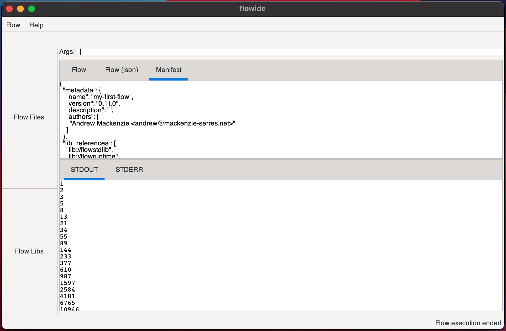

# `flowide`
This is an experiment in building a visual IDE (using gtk3) for [flow](http://github.com/andrewdavidmackenzie/flow) 
programs.

Currently, it allows you to:
  * Load a flow description by selecting a `toml` flow description file via a file dialog
    * The flow JSON representation is shown in text in the "Flow (json)" tab
  * Compile the flow to it's manifest format (also json) using `flowclib`
    * The manifest is shown in JSON text in the "Manifest" tab
  * Load a pre-compiled JSON manifest directly
    * JSON is shown in text in the "Manifest" tab
  * Run the compiled flow from its manifest
    * STDERR and STDOUT are shown in two tabs
    
# Example UI
The UI is still very basic, but here it is after having loaded the "fibonacci" flow from context.toml description
file, compiled it to manifest.json manifest format (using `flowlibc`) and then the outout on the `STDOUT` tab when 
running it (using `flowrlib`).
